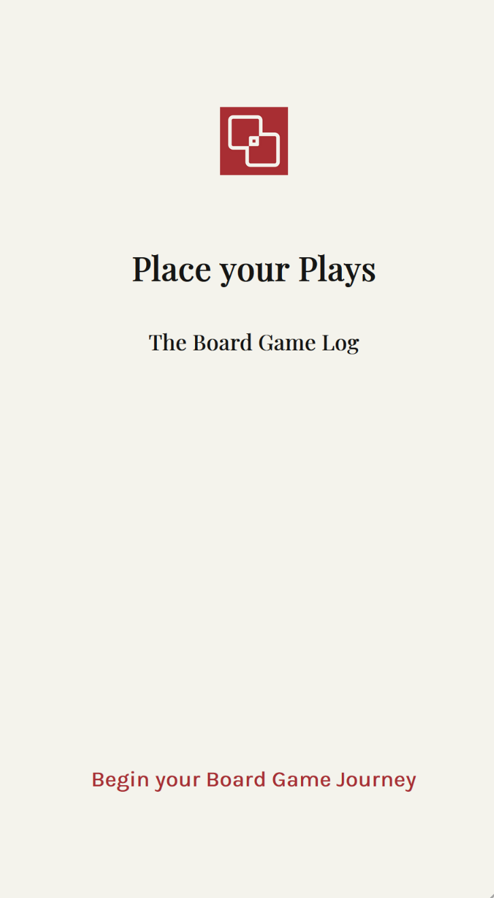
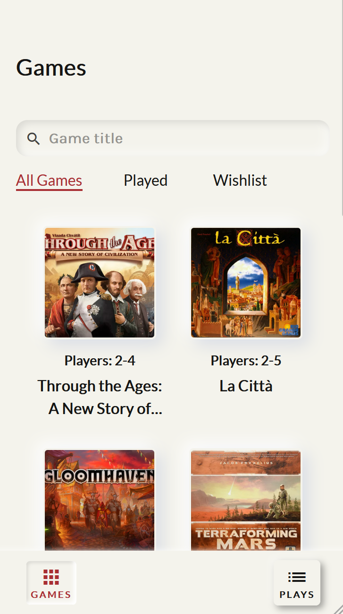
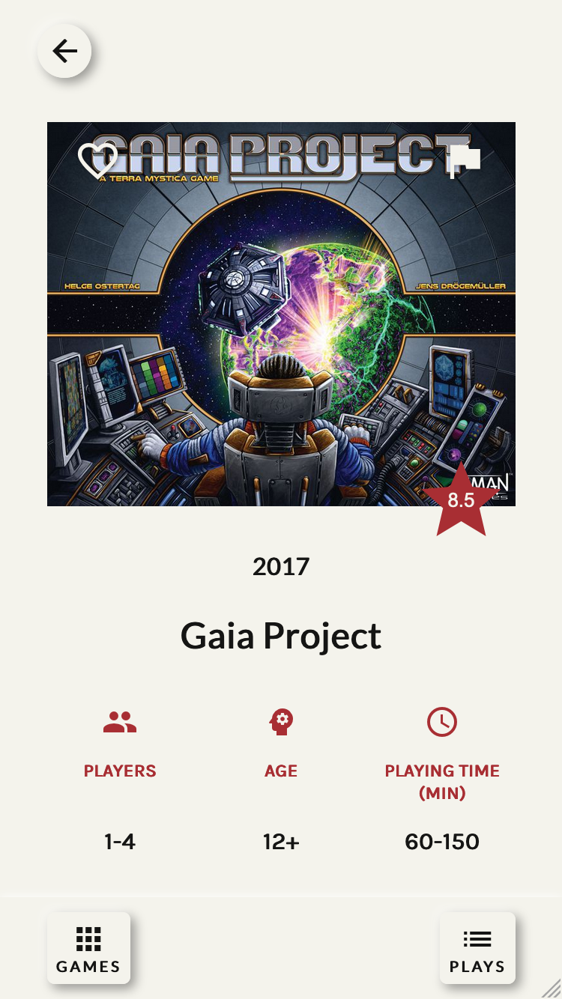
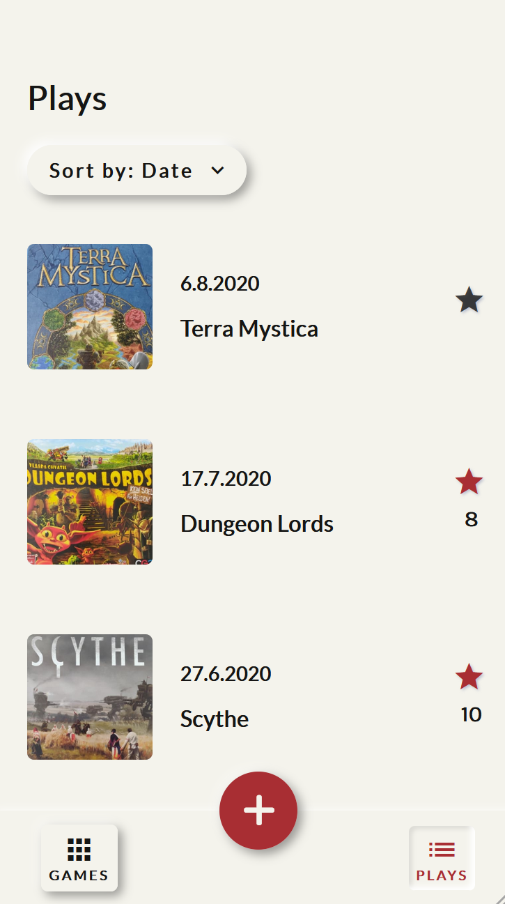
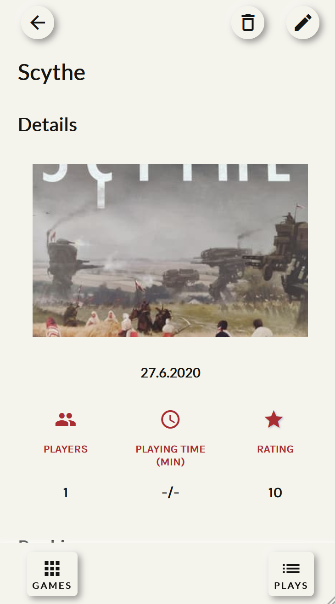
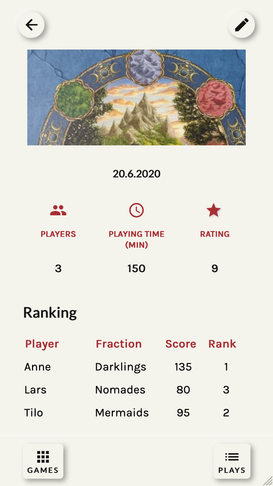

# Place your Plays - The Board Game Log

The app for tracking and analyzing board games

## What's new

- Search for games.
- Plays can be sorted alphabetically, by date, and by rating.
- Notes can be added to game sessions.

## Description

Place your Plays helps board game lovers and novices to track, organize, and analyze their board game sessions. Add information of the latest play including players and playing time to your personal list. Capture and upload images to better memorize the play. Analyse your performance and achievements by rating your plays, comparing fractions and scores reached. Explore new games with the integrated BoardGameGeek game collection (BGG-API) and add them to your wish list. When you finished a game, you can mark it as played. Let the next play begin!

The app can be used on desktop and mobile devices, but it is highly recommended for mobile and tablet usage. It is most ideal for iPhone 6/7/8.

## Keywords

- Entertainment
- Board games
- Social

## Key features

- Upload images
- Take notes on scores
- Comment game sessions
- Create a wish list
- Mark games as played

## Tech stack

- React
- React-Router
- React Hooks
- StyledComponents
- PropTypes
- Formik
- Yup Validation
- Storybook
- Node.js
- Axios
- Express
- MongoDB
- Mongoose
- localStorage
- Docker
- React Testing Library
- Jest Unit-Tests
- Cypress
- Git Workflow
- Vercel

## Video

## Impressions

  

  
